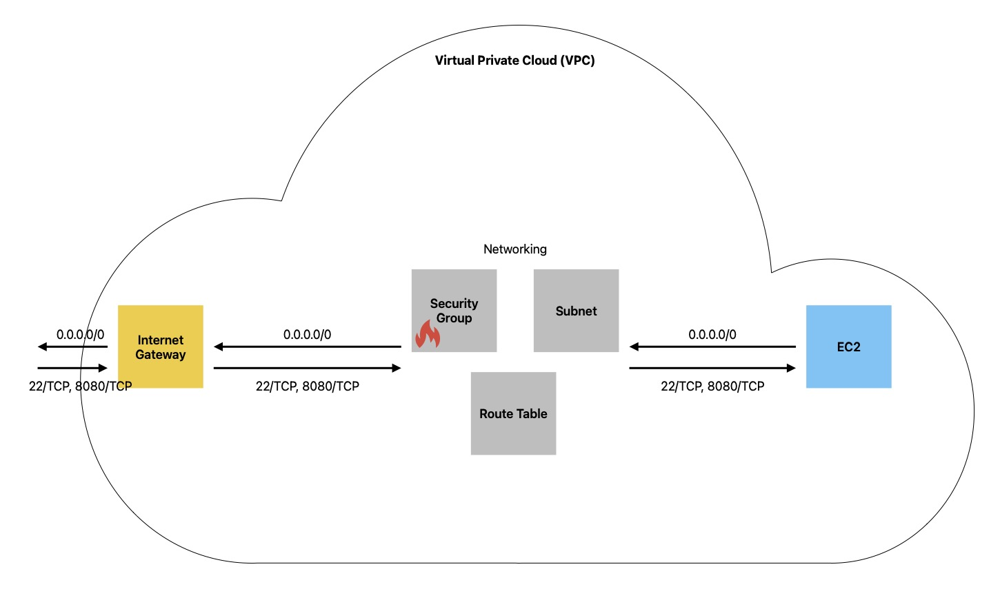

# AWS Terraform – VPC with EC2 & SSH Access

This project uses **Terraform** to provision a simple AWS infrastructure consisting of:

- a **VPC**
- a **public subnet**
- an **Internet Gateway**
- a **route table**
- a **security group**
- an **EC2 instance (Amazon Linux 2)**
- an **SSH key pair** for secure access

The setup is intended for **learning and demonstration purposes**.

---

## 🏗️ Architecture



**Traffic flow:**

Internet  
→ Internet Gateway  
→ Route Table (`0.0.0.0/0`)  
→ Subnet  
→ Security Group (ports 22 & 8080)  
→ EC2 Instance  

---

## 📦 AWS Resources Used

- `aws_vpc`
- `aws_subnet`
- `aws_internet_gateway`
- `aws_default_route_table`
- `aws_default_security_group`
- `aws_key_pair`
- `aws_instance`
- `aws_ami` (latest Amazon Linux 2, resolved dynamically)

---

## 🔐 Networking & Security

### Security Group Rules

**Ingress**
- SSH (`22/TCP`) – restricted to your public IP
- Application (`8080/TCP`) – open to `0.0.0.0/0`

**Egress**
- All outbound traffic allowed (`0.0.0.0/0`)

---

## 🔑 SSH Key Pair

The EC2 instance uses an SSH key pair created from a **local public key file**:

```hcl
resource "aws_key_pair" "ssh-key" {
  key_name   = "server-key"
  public_key = file(var.public_key_location)
} 
```

---

## ⚙️ Variables
The following variables must be defined (for example in terraform.tfvars):

```hcl
vpc_cidr_block      = "10.0.0.0/16"
subnet_cidr_block   = "10.0.1.0/24"
avail_zone          = "eu-central-1a"
env_prefix          = "dev"
my_ip               = "X.X.X.X/32"
instance_type       = "t2.micro"
ssh_key_name        = "server-key"
public_key_location = "~/.ssh/<your_key>.pub"
image_name          = "amzn2-ami-kernel-*-gp2"
```

Notes:
- my_ip must be your current public IP address in CIDR notation
- env_prefix is used to namespace AWS resources

---

## 🗄️ Terraform State Backend (S3)
This repository uses a remote backend on Amazon S3 to store Terraform state centralized and consistent.

---

## 🚀 Deployment

### 0. Configure AWS Authentication

Before running Terraform, make sure your AWS credentials are set up. Terraform will use the standard AWS credentials file located at **~/.aws/credentials**.

Example content:

```ini
[default]
aws_access_key_id     = YOUR_AWS_ACCESS_KEY_ID
aws_secret_access_key = YOUR_AWS_SECRET_ACCESS_KEY
aws_default_region    = eu-central-1
```

Terraform will automatically pick up this profile. You can also set a custom profile by exporting:
```bash
export AWS_PROFILE=your_profile_name
```

### 1. Initialize Terraform
```bash
terraform init
```
### 2. Review the execution plan
```bash
terraform plan
```

### 3. Apply the configuration
```bash
terraform apply
```
Confirm with yes when prompted.

---

## 📤 Outputs

After a successful deployment, Terraform outputs:
- **AMI ID** used for the EC2 instance
- **Public IP** address of the EC2 instance

---

## 🔌 Connect to the EC2 Instance

Connect using the default Amazon Linux user:
ssh ec2-user@<EC2_PUBLIC_IP>

---

## 🧹 Cleanup

To destroy all AWS resources created by this project:
```bash
terraform destroy
```

## 🙏 Credits / Acknowledgements

This project was inspired by the **DevOps Bootcamp** by **[TechWorld with Nana](https://www.techworld-with-nana.com/devops-bootcamp)**.
